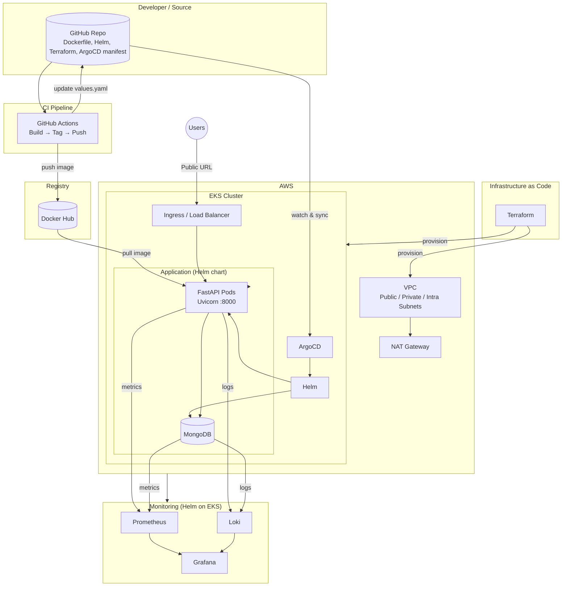

# Architecture Diagram Prompt

Use this prompt with an AI diagram generator (e.g. Cursor, ChatGPT, Mermaid, or tools like Excalidraw / draw.io) to create the **Product Catalog Backend – DevOps Architecture** diagram.

---

## Prompt (copy-paste)

**Create an architecture diagram for this system:**

### 1. Source & CI (left side)

- **GitHub** – Git repository containing: FastAPI app code, Dockerfile, docker-compose, Helm chart (`helm/product-api`), Terraform (`terraform/`), ArgoCD app manifest (`argocd/api.yaml`), GitHub Actions workflow (`.github/workflows/dynamic.yml`).
- **GitHub Actions** (CI):
  - Trigger: push to `main` or `feature/devops-assignment-setup` when Dockerfile, `*.py`, or `requirements.txt` change.
  - Steps: checkout → build Docker image → tag with git commit SHA → push image to **Docker Hub**.
  - Then: update `helm/product-api/values.yaml` with new image tag and push back to GitHub.
- **Docker Hub** – Container registry storing image `username/backend-product-api:<commit-sha>`.

Draw: **GitHub** → **GitHub Actions** → **Docker Hub**. Show that GitHub Actions also pushes a commit back to **GitHub** (values.yaml update).

---

### 2. GitOps CD (center-left)

- **ArgoCD** runs inside the Kubernetes cluster.
- ArgoCD watches the **GitHub** repo (same repo as above) for the path `helm/product-api` and `values.yaml`.
- When the repo changes (e.g. new image tag from CI), ArgoCD syncs and deploys/updates using **Helm**.
- So: **GitHub** (source of truth) ← watched by **ArgoCD** → deploys via **Helm** to **Kubernetes**.

Draw: **GitHub** ← **ArgoCD** (in cluster). ArgoCD uses **Helm** to deploy to **Kubernetes**.

---

### 3. AWS infrastructure (bottom / cloud)

- **Terraform** (IaC) provisions all AWS resources. Show Terraform as the “provisioner” box.
- **AWS VPC** (e.g. 10.0.0.0/16) with:
  - **Public subnets** (e.g. 10.0.1.0/24, 10.0.2.0/24) in two AZs.
  - **Private subnets** (e.g. 10.0.3.0/24, 10.0.4.0/24).
  - **Intra subnets** (e.g. 10.0.5.0/24, 10.0.6.0/24).
  - **NAT Gateway** for private subnet egress.
- **Amazon EKS** cluster inside the VPC:
  - Public API endpoint.
  - Add-ons: CoreDNS, kube-proxy, VPC-CNI.
- **EKS managed node group** (e.g. name `bankapp-ng`): SPOT instances (e.g. t2.medium), min 2 / max 3 nodes, in private subnets.
- **Security groups** and **IAM roles** (managed by Terraform EKS/VPC modules).

Draw: **Terraform** → **VPC** (with subnets + NAT). **EKS** inside VPC. **Node group** as part of EKS. Optional: small boxes for Security Groups and IAM.

---

### 4. Kubernetes / EKS (center)

- **EKS cluster** runs:
  - **ArgoCD** (watches GitHub, runs Helm).
  - **Helm chart** `product-api` deploys:
    - **FastAPI** deployment (Uvicorn, port 8000), from image on Docker Hub.
    - **MongoDB** deployment (data store).
  - **Kubernetes Service(s)** for FastAPI (and optionally Ingress or LoadBalancer for public access).
- **Ingress** or **Load Balancer** (optional) to expose FastAPI to the internet → **Public URL**.

Draw: **EKS** box containing: **ArgoCD**, **FastAPI pods**, **MongoDB pods**, **Service**, and optionally **Ingress/LoadBalancer** → **Users / Public URL**.

---

### 5. Monitoring stack (right side, inside Kubernetes)

- All run on the same **EKS** cluster (or show as adjacent to the app namespace).
- **Prometheus** – scrapes metrics from pods (CPU, memory, etc.).
- **Loki** – collects logs from the application and other workloads.
- **Grafana** – connects to Prometheus and Loki; shows dashboards (CPU, memory, pod count/status, logs).

Draw: **Prometheus** (scrapes **FastAPI** and **MongoDB** pods). **Loki** (ingests logs from same pods). **Grafana** (queries Prometheus + Loki). Optional: “Metrics” and “Logs” arrows from app pods to Prometheus and Loki.

---

### 6. Data flow summary

- **Developers** push code to **GitHub**.
- **GitHub Actions** builds Docker image, pushes to **Docker Hub**, updates **values.yaml** in **GitHub**.
- **ArgoCD** sees the change, runs **Helm** to deploy/update the app on **EKS**.
- **EKS** was provisioned by **Terraform** (VPC, EKS, node group).
- **Users** hit **Public URL** → **Ingress/LB** → **FastAPI** → **MongoDB**.
- **Prometheus** and **Loki** observe the app; **Grafana** visualizes metrics and logs.

---

### Style and layout

- Use clear boxes for: GitHub, GitHub Actions, Docker Hub, Terraform, VPC, EKS, ArgoCD, Helm, FastAPI, MongoDB, Prometheus, Loki, Grafana, Ingress/LB, Public URL.
- Use arrows with short labels where helpful (e.g. “push image”, “watch & sync”, “provisions”, “metrics”, “logs”, “HTTP”).
- Prefer a left-to-right or top-to-bottom flow: Source/CI (left) → Registry → GitOps → Cloud (AWS) → K8s + App → Monitoring (right).
- Optionally use two layers: “CI/CD & GitOps” on top and “AWS & EKS runtime” below, with Terraform and EKS connecting them.

---

## Optional: Mermaid-style summary for code diagram

```
Developer → GitHub → GitHub Actions → Docker Hub
                ↓
            ArgoCD (in EKS) ← watches GitHub
                ↓
            Helm → EKS (FastAPI + MongoDB)
                ↑
            Terraform → AWS VPC + EKS + Node Group
                ↓
            Users → Ingress/LB → FastAPI → MongoDB
                ↓
            Prometheus + Loki → Grafana
```

Use this prompt as-is or adapt it for your preferred diagram tool (Mermaid, PlantUML, Excalidraw, draw.io, or AI image generator).

---

## Ready-to-use Mermaid diagram

Copy the block below into a Mermaid-compatible viewer (GitHub README, Mermaid Live Editor, or VS Code Mermaid extension) to render the architecture.


